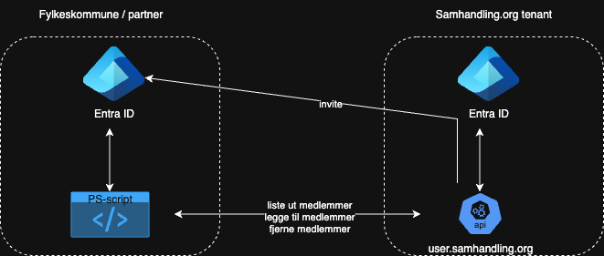

# Samhandling User Management
PowerShell-skript for administrasjon av brukere i Teams-grupper tilknyttet samhandling.org. Skriptet leser medlemskap i grupper fra organisasjonens Entra ID og benytter [API-et i samhandling.org](https://github.com/vestfoldfylke/samhandling-user-management-api) for å legge til eller fjerne brukere fra Samhandling. API-et sørger for å invitere brukere som ikke allerede finnes i samhandling-tenanten. Brukermatching mellom fylkets og samhandling-tenanten baseres på mail-egenskapen. API-et håndterer også oppdatering av mail-egenskapen ved behov.



## Oppsett og installasjon

1. **Installer PowerShell (hvis nødvendig)**
Skriptet krever PowerShell 5.1 eller nyere. Hvis du bruker macOS eller Linux, anbefales det å installere PowerShell Core (7.x). Du kan laste det ned fra [PowerShells offisielle nettside](https://learn.microsoft.com/en-us/powershell/scripting/install/installing-powershell?view=powershell-7.5).

1. **Installer nødvendige PowerShell-moduler**  
    Sørg for at følgende moduler er installert:
    ```powershell
    Install-Module -Name Microsoft.Graph.Authentication -Force
    Install-Module -Name Microsoft.Graph.Groups -Force
    ```

1. **Klone repoet der det skal kjøres fra**
```bash
git clone https://github.com/vestfoldfylke/samhandling-invitescript.git
cd samhandling-invitescript
```

1. **Opprett en App Registration i Azure**

    1. **Logg inn på Azure-portalen**  
        Gå til [Azure-portalen](https://portal.azure.com) og logg inn med en konto som har nødvendige rettigheter.

    2. **Naviger til App Registrations**  
        I søkefeltet øverst, søk etter "App registrations" og velg det fra resultatene.

    3. **Opprett en ny App Registration**  
        Klikk på **New registration** og fyll ut følgende:
        - **Name**: Gi appen et beskrivende navn, f.eks. `SamhandlingUserManagement`.
        - **Supported account types**: Velg "Accounts in this organizational directory only".
        - **Redirect URI**: Dette kan stå tomt for denne applikasjonen.

        Klikk på **Register** for å opprette appen.

    4. **Legg til API-tillatelser**  
        - Gå til **API permissions** i menyen til venstre.
        - Klikk på **Add a permission** og velg **Microsoft Graph**.
        - Velg **Application permissions** og legg til:
          - `GroupMember.Read.All`
          - `User.Read.All`
        - Klikk på **Grant admin consent** for å gi nødvendige tillatelser.

    5. **Opprett en Client Secret**  
        - Gå til **Certificates & secrets** i menyen til venstre.
        - Klikk på **New client secret**.
        - Gi den en beskrivelse og velg en utløpstid.
        - Klikk **Add** og kopier verdien av hemmeligheten. Denne brukes som `$CLIENT_SECRET`.

    6. **Noter ned App ID og Tenant ID**  
        - Gå til **Overview** i menyen til venstre.
        - Kopier **Application (client) ID** og **Directory (tenant) ID**. Disse brukes som henholdsvis `$CLIENT_ID` og `$TENANT_ID`.

    App-registreringen er nå klar til bruk.

1. **Opprett miljøvariabler**  
    Opprett en `env.ps1`-fil i samme katalog som skriptet. Filen må encodes slik at norske tegn vises (eks. UTF-8 with BOM) Filen skal inneholde følgende miljøvariabler:
    ```powershell
    # Microsoft Graph API-innstillinger
    $CLIENT_ID = "<Din Client ID>"
    $TENANT_ID = "<Din Tenant ID>"
    $CLIENT_SECRET = ConvertTo-SecureString -String "<Din Client Secret>" -AsPlainText -Force 

    # Logginnstillinger
    $LOG_DIRECTORY = "./logs"

    # Samhandling API-innstillinger
    $FUNCTION_KEY = "<API-nøkkel>" # Denne nøkkelen tildeles av vertsorganisasjonen
    $COUNTY_KEY = "<Fylkesnøkkel>" # Denne nøkkelen tildeles av vertsorganisasjonen og brukes til å styre hvilke brukere du har tilgang til å håndtere i Samhandling.org. Nøkkelen er mappet mot gyldige e-postsuffixer som API-et kan håndtere.

    # Gruppemapping (målgruppe -> kildegruppe)
    $GROUP_MAPPING = @{
        # "<Samhandling-gruppenavn>" = "<Entra-gruppenavn fra egen tenant>"
        "IT-Forum"                              = "<Entra-gruppenavn fra egen tenant>"
        "Elements forvaltning"                  = "<Entra-gruppenavn fra egen tenant>"
        "PVO i fylkeskommunene"                 = "<Entra-gruppenavn fra egen tenant>"
        "SAMS"                                  = "<Entra-gruppenavn fra egen tenant>"
        "Fylkeskommunalt HR-nettverk"           = "<Entra-gruppenavn fra egen tenant>"
        "Fylkeskommunalt arkivledernettverk"    = "<Entra-gruppenavn fra egen tenant>"
        "Produktrad for Prosjektportalen"       = "<Entra-gruppenavn fra egen tenant>"
        "Fylkeskultursjefkollegiet"             = "<Entra-gruppenavn fra egen tenant>"
        "FK-samarbeid dig. og IKT"              = "<Entra-gruppenavn fra egen tenant>"
        "HR og IKT-digitaliseringskollegiet"    = "<Entra-gruppenavn fra egen tenant>"
        "Fylkesnettverk for innovasjon"         = "<Entra-gruppenavn fra egen tenant>"
        "Informasjonssikkerhet og personvern"   = "<Entra-gruppenavn fra egen tenant>"
        "Opplæring"                             = "<Entra-gruppenavn fra egen tenant>"
        "Fylkeskommunalt Innkjøpsforum"         = "<Entra-gruppenavn fra egen tenant>"
        "Tannhelse"                             = "<Entra-gruppenavn fra egen tenant>"
        "Fylkeskommunalt eiendomsforum (FEF)"   = "<Entra-gruppenavn fra egen tenant>"
        "Samferdsel"                            = "<Entra-gruppenavn fra egen tenant>"   
    }
    ```

1. **Opprett loggmappe**  
    Sørg for at mappen spesifisert i `$LOG_DIRECTORY` eksisterer, eller la skriptet opprette den automatisk.

1. **Kjør skriptet**  
    Start skriptet ved å kjøre:
    ```powershell
    .\samhandling-user-management.ps1
    ```
    Vi anbefaler å kjøre skriptet som en scheduled task

## Feilsøking
- **Feil**: `Miljøvariabelen ... er ikke satt.`
    - Sørg for at alle nødvendige miljøvariabler er definert i env.ps1.
- **Feil**: `Feil ved tilkobling til Microsoft Graph.`
    - Kontroller at klient-ID, klienthemmelighet og tenant-ID er riktige.
    - Sørg for at appen har nødvendige API-tillatelser.
- **Feil**: `Miljøfilen env.ps1 ble ikke funnet.`
    - Sørg for at env.ps1 ligger i samme mappe som skriptet.
- **Feil**: `Forbidden: User mail (mail) does not match any of the allowed UPN suffixes: [list of allowed suffixes for your county key]`
    - Ta kontakt med vertsorganisasjonen for å få lagt til nye suffixes.